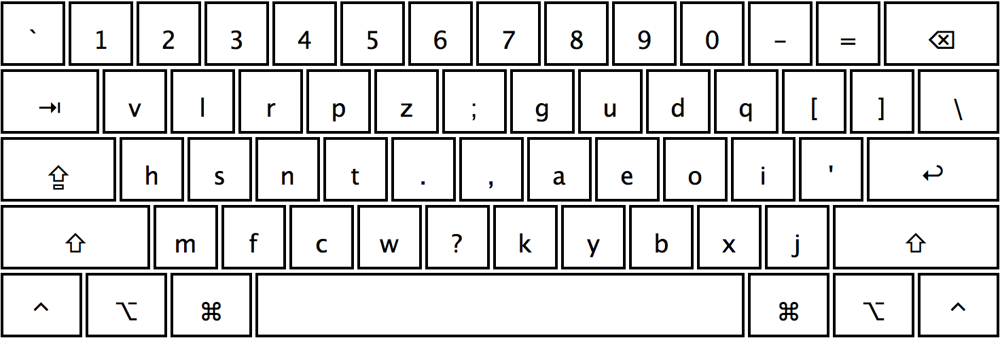

# Halmak Keyboard Layout

This is an AI designed keyboard layout that was built within the
[keyboard-gentics](https://github.com/MadRabbit/keyboard-genetics) project.
More details and a documented process can be found in
[this blog](http://nikolay.rocks/categories/optimal+keyboard)

## Features

* Build based on the real world hand movements analysis
* Nearly maximal possible typing efficiency
* Very low overall fingers movement distance
* Very low same finger / same hand usage overheads
* Very low overall horizontal hands movement
* Highly symmetrical design that accounts for individual fingers strength
* Designed with the modern, web based English in mind

## Comparisons

During the research I've identified the following results: in terms of efficiency

* `QWERTY` - `0%` (base line)
* `Dvorak` - `+77%`
* `Colemak` - `+84%`
* `Workman` - `+101%`
* `Halmak` - `+134%`

Please refer to [this article](http://nikolay.rocks/2016-12-20-the-halmak-reborn)
for the more detailed breakdown of the results.

All scripts are opensourced and can be verified in the
[keyboard-gentics](https://github.com/MadRabbit/keyboard-genetics) repository.

## The Name

The name is a combination of `HAL-9000`, as a reference to the layout being
designed by an AI. And, `Dvorak` as a gratitude to Mr. Dvorak for his dedication
to the layouts optimizations process. The letter `m` in between is just to make
it sound nicer. Or is it!?...

## Installation

* Git clone all the stuff somewhere
* Copy `Halmak.bundle` into your `/Library/Keyboard Layouts` folder (create if it is missing)
* Sign out, Sign in
* Go to the keyboard preferences and add the `Halmak` layout
* Ask here in issues if nothing works

### Android installation for physical keyboards

1. Install [Extra Physical Keyboard Layouts from the Play Store](https://play.google.com/store/apps/details?id=varzan.extraKeyboardLayouts)  
Source code is available [on github](https://github.com/varzan/extra-keyboard-layouts)
1. Connect a physical keyboard to your Android device e.g. via bluetooth or OTG
1. Select the Halmak layout in your system menu e.g. System > Language and Input > Physical keyboard > *Keyboard Name*

## Integrations

### Kinesis Advantage 2

To enable native key mapping for Halmak on your [Kinesis Advantage 2](https://kinesis-ergo.com/shop/advantage2/)

1. <kbd>Program</kbd>+<kbd>Shift</kbd>+<kbd>Escape</kbd> to enable power user mode (should see 4 LED flashes)
1. <kbd>Program</kbd>+<kbd>F1</kbd> to mount to the keyboard as a drive (should see a few flashes)
1. Drag the file into `ADVANTAGE2` / `active`
1. Open Disk Utility, right click on the drive, select Eject (must be eject, as unmount does not write the file)
1. <kbd>Program</kbd>+<kbd>F3</kbd> to enable QWERTY, then <kbd>Program</kbd>+<kbd>1</kbd> to enable our Halmak modification of QWERTY

Refer to the [Kinesis Advantage 2 support page](https://kinesis-ergo.com/support/advantage2/) for assistance.

### Type Fu

To learn Halmak, we have an integration for [Type Fu](http://type-fu.com).

1. [Download our `Halmak.tfl` file](https://raw.githubusercontent.com/balupton/halmak/master/integrations/typefu/Halmak.tfl)
1. Open Type Fu
1. Preferences
1. Keyboard
1. Hamburger menu
1. Import from File
1. Select the file you downloaded from the first step

## Copyright & License

Again, I'm not sure if there is a point to this. But I guess it's MIT.

Copyright (C) 2016 Nikolay Nemshilov
